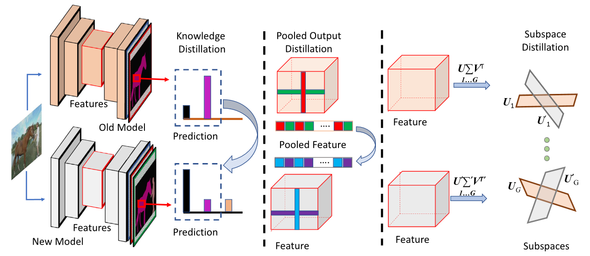

# Subspace Distillation for Continual Learning

<p align="center" style="text-align: center;">
    
    Code for Published paper at Neural Networks 2023 <a style='ext-align: center;' href="https://www.sciencedirect.com/science/article/pii/S0893608023004057">Subspace Distillation for Continual Learning</a>.
</p>


# Abstract
An ultimate objective in continual learning is to preserve knowledge learned in preceding tasks while
learning new tasks. To mitigate forgetting prior knowledge, we propose a novel knowledge distillation
technique that takes into the account the manifold structure of the latent/output space of a neural
network in learning novel tasks. To achieve this, we propose to approximate the data manifold up-
to its first order, hence benefiting from linear subspaces to model the structure and maintain the
knowledge of a neural network while learning novel concepts. We demonstrate that the modeling
with subspaces provides several intriguing properties, including robustness to noise and therefore
effective for mitigating Catastrophic Forgetting in continual learning. We also discuss and show how
our proposed method can be adopted to address both classification and segmentation problems.
Empirically, we observe that our proposed method outperforms various continual learning methods
on several challenging datasets including Pascal VOC, and Tiny-Imagenet. Furthermore, we show how
the proposed method can be seamlessly combined with existing learning approaches to improve their
performances.


# Repository Contributions

This repository contains the implementation of the paper 'Subspace Distillation for Continual Learning'. 

If you find this code useful, please reference in our paper:

```
@article{roy2023subspace,
  title={Subspace distillation for continual learning},
  author={Roy, Kaushik and Simon, Christian and Moghadam, Peyman and Harandi, Mehrtash},
  journal={Neural Networks},
  volume={167},
  pages={65--79},
  year={2023},
  publisher={Elsevier}
}
```

# Getting Started

SDCL is an end-to-end training strategy for continual learning model trained on a series of novel datasets. Please follow the instructions outlined below.

- Clone the code of [Dark Experience for General Continual Learning: a Strong, Simple Baseline](https://github.com/aimagelab/mammoth)
- Go the the Mammoth code directory
- Add the sdcl.py to the ./models/ directory
- Use ./utils/main.py to run the experiments.
- Reproduce the results in the paper by executing the following
```
python ./utils/main.py --dataset <dataset> --model <model> --buffer_size <buffer_size> --batch_size <batch_size> --minibatch_size <minibatch_size> --lr <learning_rate> --alpha <alpha> --beta <beta>
```
Examples [Please refer to the paper for the hyperparameters]:
```
python ./utils/main.py --dataset seq-cifar10 --model sdcl --buffer_size 500 --batch_size 32 --minibatch_size 32 --lr .03 --alpha 1.0 --beta 1.0
```

# Acknowledgement
We would like to acknowledge the authors of [Dark Experience for General Continual Learning: a Strong, Simple Baseline](https://github.com/aimagelab/mammoth) for their excellent codebase which has been used as a starting point for this project.
